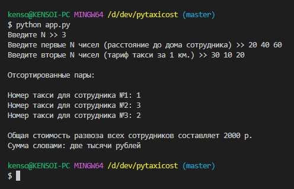
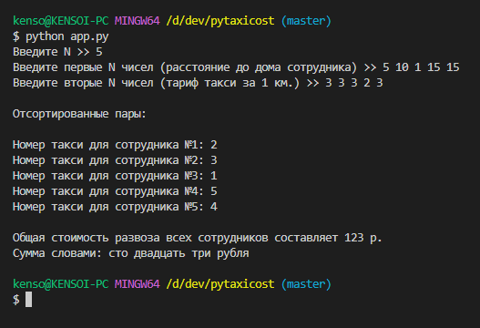

# Лабораторная работа № 4
Выполнил Прокофьев Андрей Фт-210008

## Описание задачи
Директор фирмы решил заказать такси, чтобы развезти сотрудников по домам. Он заказал N машин — ровно столько, сколь у него сотрудников. У каждого водителя такси свой тариф за 1 километр. Директор знает, какому сотруднику сколько километров от работы до дома. Директор хочет определить, какой из сотрудников на каком такси должен поехать домой, чтобы суммарные затраты на такси были минимальны.  

## Описание программы
Программа сортирует сотрудников по расстоянию до дома и таксистов по цене проезда за 1 км с целью минимизировать расходы на поездки.

## Запуск
```bash
python3 app.py
```

## Скриншоты
### Первый тест


### Второй тест



## Использованные библиотеки
[PyConvertNum](https://github.com/kensoidev/pyconvertnum) - Программа, конвертирующая числа в пределах [1, 999999] из цифровой в словесную форму